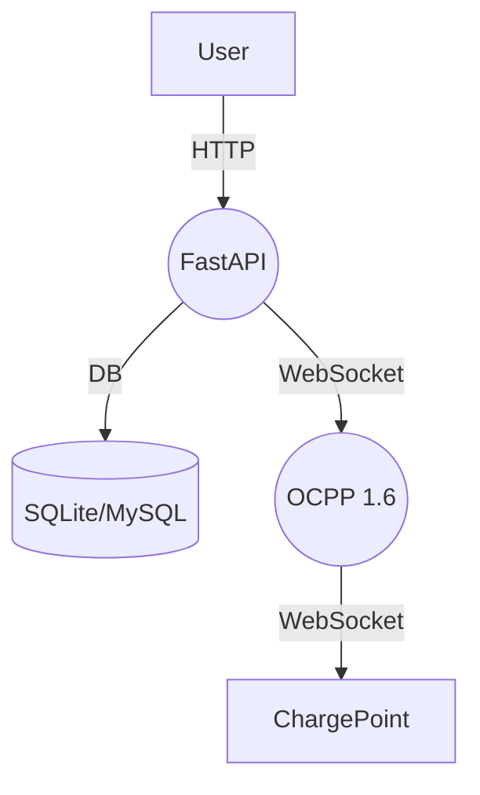

# EV Charging Service

This project provides a simplified prepaid EV charging backend using FastAPI and OCPP 1.6 libraries. It demonstrates user registration, login, balance top-up and charging session tracking. Secrets and database configuration are provided through environment variables.

## Setup

1. Install dependencies

```bash
pip install -r requirements.txt
```

2. Copy `.env.example` to `.env` and adjust values for your environment.

3. Run the server

```bash
uvicorn app.main:app --reload
```

## Running tests

```bash
pytest
```

## Architecture



### Message flow
1. User signs up or logs in obtaining a token.
2. User tops up balance via Paysera (mocked endpoint).
3. When a charging station initiates a session, the app verifies user balance.
4. Energy consumption is reported over OCPP and balance is deducted.
5. Session stops automatically if balance is insufficient.

### Security and scalability considerations
- Passwords are hashed using bcrypt (`passlib`).
- All configuration and credentials are supplied via environment variables and should be encrypted at rest.
- Use HTTPS for all endpoints.
- For production deploy behind a WSGI server and use a scalable database.

